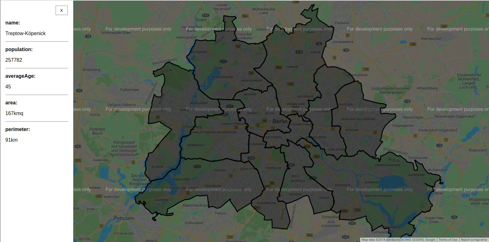

# geo-location-2

>  GeoLocation using Google Map API




# Application structure

```
/src
├── components/
│   ├── Map
│   └── Sidebar 
├── models/
├── services/
├── store/
├── view/
├── main.ts
└── router.ts
```

## Components

Self explanatory: the components of the application

## Models

Interfaces of the application. Further class implementation for a cleaner initialization will be placed here.

## Services

Fake api request, here pointing to the JSON static file.
Can be easily replaced with a real HTTP API request.

## Store

Here are handled all the interactions with the data, from the store object tree generation, with actions, mutators and getters.

## Router.ts

Router of the application. Further implementation with name as dynamic routing value to be used.

## Project setup
```
yarn install
```

### Compiles and hot-reloads for development
```
yarn run serve
```

### Compiles and minifies for production
```
yarn run build
```

### Lints and fixes files
```
yarn run lint
```

### Run your unit tests
```
yarn run test:unit
```

### Run your end-to-end tests
```
yarn run test:e2e
```
